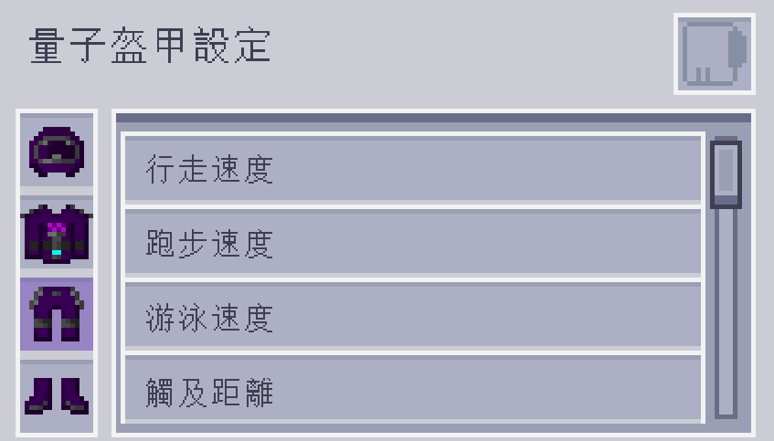

---
navigation:
  parent: aae_intro/aae_intro-index.md
  title: 量子盔甲套裝
  icon: advanced_ae:quantum_helmet
categories:
  - advanced items
item_ids:
  - advanced_ae:quantum_helmet
  - advanced_ae:quantum_chestplate
  - advanced_ae:quantum_leggings
  - advanced_ae:quantum_boots
  - advanced_ae:quantum_upgrade_base
  - advanced_ae:walk_speed_card
  - advanced_ae:sprint_speed_card
  - advanced_ae:step_assist_card
  - advanced_ae:jump_height_card
  - advanced_ae:lava_immunity_card
  - advanced_ae:flight_card
  - advanced_ae:water_breathing_card
  - advanced_ae:auto_feeding_card
  - advanced_ae:auto_stock_card
  - advanced_ae:magnet_card
  - advanced_ae:hp_buffer_card
  - advanced_ae:evasion_card
  - advanced_ae:regeneration_card
  - advanced_ae:strength_card
  - advanced_ae:attack_speed_card
  - advanced_ae:luck_card
  - advanced_ae:reach_card
  - advanced_ae:swim_speed_card
  - advanced_ae:night_vision_card
  - advanced_ae:flight_drift_card
  - advanced_ae:recharging_card
  - advanced_ae:portable_workbench_card
  - advanced_ae:pick_craft_card
---

# 量子盔甲套裝

<Row gap="10">
<ItemImage id="advanced_ae:quantum_helmet" scale="4"></ItemImage>
<ItemImage id="advanced_ae:quantum_chestplate" scale="4"></ItemImage>
<ItemImage id="advanced_ae:quantum_leggings" scale="4"></ItemImage>
<ItemImage id="advanced_ae:quantum_boots" scale="4"></ItemImage>
</Row>

* <ItemLink id="advanced_ae:quantum_helmet" />
* <ItemLink id="advanced_ae:quantum_chestplate" />
* <ItemLink id="advanced_ae:quantum_leggings" />
* <ItemLink id="advanced_ae:quantum_boots" />

你是否曾想像過，將你的 AE 系統穿戴在身上會是什麼感覺？

好消息，這一切不再只是幻想！

量子盔甲套裝是一種高科技裝備，能直接連線上你的 AE2 系統，讓你隨時隨地輕鬆存取所有物品！

預設情況下，這套盔甲需要以能量驅動，其防禦能力與獄髓裝備相當。

它能利用能量緩衝區產生能量護盾，吸收大量的傷害。

穿上靴子還能免疫墜落傷害，而胸甲則能消除飛行時的挖掘速度懲罰。

然而，這套盔甲的真正力量，只有在安裝升級後才能體現！

---

## 連結至系統

盔甲的每個部件，都可以透過放入 <ItemLink id="ae2:wireless_access_point" /> 的對應欄位，來個別連結至系統。

這將根據裝備部件和已安裝的升級卡，解鎖不同的額外功能。

詳情將於稍後介紹。

請注意，為了使這些額外功可以正常運作，你還必須待在存取點的訊號範圍內。

---

## 安裝升級

若要安裝升級，你需要先將盔甲裝備在身上，然後按下快捷鍵開啟量子盔甲設定選單。

在這個介面中，你可以安裝／卸除升級、開關其功能，並調整升級設定。

---

## 量子升級卡（空白）

<ItemImage id="advanced_ae:quantum_upgrade_base" scale="2"></ItemImage>

<ItemLink id="advanced_ae:quantum_upgrade_base" />本身並沒有什麼特別的功能，但它被用作所有升級卡的合成材料。

---

## 自動餵食卡

<ItemImage id="advanced_ae:auto_feeding_card" scale="2"></ItemImage>

將要用於餵食玩家的物品，拖曳至升級卡的篩選欄位。

<ItemLink id="advanced_ae:auto_feeding_card" />將會使用這些物品來餵食玩家。

若裝備已連結至 AE2 網路，它會在玩家飢餓時，嘗試從系統中尋找，並餵食這些物品。

---

## 自動補貨卡

<ItemImage id="advanced_ae:auto_stock_card" scale="2"></ItemImage>

使用<ItemLink id="advanced_ae:auto_stock_card" />會需要將裝備連結至 AE2 網路，且玩家必須待在存取點的訊號範圍內。

你可以在升級的設定介面中，將物品拖曳至篩選欄位，控制這些物品在玩家物品欄的保留數量。

每個篩選欄位都可設定超過一組的數量，使升級卡補充超過一格物品欄的物品。

---

## 速度卡

<Row gap="10">
<ItemImage id="advanced_ae:walk_speed_card" scale="2"></ItemImage>
<ItemImage id="advanced_ae:sprint_speed_card" scale="2"></ItemImage>
<ItemImage id="advanced_ae:swim_speed_card" scale="2"></ItemImage>
</Row>

* <ItemLink id="advanced_ae:walk_speed_card" />
* <ItemLink id="advanced_ae:sprint_speed_card" />
* <ItemLink id="advanced_ae:swim_speed_card" />

這些升級卡能加快穿戴者的移動速度。

你可以在升級的設定介面中，精確調整加速幅度，此調整也會影響潛行與飛行時的速度。

值得注意的是，這些升級也能用於減慢速度，以便在其他加速效果生效時，提供更精確的控制。

---

## 高度卡

<Row gap="10">
<ItemImage id="advanced_ae:jump_height_card" scale="2"></ItemImage>
<ItemImage id="advanced_ae:step_assist_card" scale="2"></ItemImage>
</Row>

* <ItemLink id="advanced_ae:jump_height_card" />
* <ItemLink id="advanced_ae:step_assist_card" />

這些升級會改變垂直移動的方式，可設定更高的跳躍高度或登階輔助。

---

## 飛行相關卡

<Row gap="10">
<ItemImage id="advanced_ae:flight_card" scale="2"></ItemImage>
<ItemImage id="advanced_ae:flight_drift_card" scale="2"></ItemImage>
</Row>

- 飛行卡

安裝<ItemLink id="advanced_ae:flight_card" />後，你將能像創造模式一樣飛行。

飛行速度可以在設定介面中，使用滑桿進行調整，且會與行走／跑步速度卡的速度加成疊加。

- 飛行慣性卡

<ItemLink id="advanced_ae:flight_drift_card" />僅在安裝飛行卡後才會有效果。

你可以在升級的設定介面中，使用滑桿調整創造模式飛行的慣性。

設定的數值越小，你靜止下來的速度越快；設為 0 時則會立即靜止。

---

## ME 無線充能卡

<ItemImage id="advanced_ae:recharging_card" scale="2"></ItemImage>

使用 <ItemLink id="advanced_ae:recharging_card" />會需要將裝備連結至 AE2 網路，且玩家必須待在存取點的訊號範圍內。

位於訊號範圍內時，安裝此升級的盔甲，會使用網路中的能量進行充能。

若將升級安裝在胸甲上，還能為物品欄中的物品充能。

---

## 攜帶式單元工作台卡

<ItemImage id="advanced_ae:portable_workbench_card" scale="2"></ItemImage>

<ItemLink id="advanced_ae:portable_workbench_card" />將單元工作台整合進你的量子套裝。

使用設定的快捷鍵，就能隨時開啟工作台的介面，且功能與方塊版本完全一致。

---

## 指向合成卡

<ItemImage id="advanced_ae:pick_craft_card" scale="2"></ItemImage>

<ItemLink id="advanced_ae:pick_craft_card" />為盔甲新增了一個快捷合成功能。

當玩家的準星指向了一個方塊時，按下你設定的「指向合成」快捷鍵，它會嘗試向系統呼叫合成。

這項功能會需要將裝備連結至 ME 網路，且指向的目標方塊，需要有對應的合成樣板。

滿足條件後，會出現一個彈出視窗，提示你設定需求的數量，

此過程與一般的自動合成請求完全相同。

---

## 實用功能卡

<Row gap="10">
<ItemImage id="advanced_ae:night_vision_card" scale="2"></ItemImage>
<ItemImage id="advanced_ae:lava_immunity_card" scale="2"></ItemImage>
<ItemImage id="advanced_ae:water_breathing_card" scale="2"></ItemImage>
<ItemImage id="advanced_ae:magnet_card" scale="2"></ItemImage>
</Row>

* <ItemLink id="advanced_ae:night_vision_card" />
* <ItemLink id="advanced_ae:lava_immunity_card" />
* <ItemLink id="advanced_ae:water_breathing_card" />
* <ItemLink id="advanced_ae:magnet_card" />

這些升級卡為穿戴者提供多種實用功能，例如免疫特定傷害與夜視。

特別是磁力卡，你可以在升級的設定介面中，

透過將物品拖曳至篩選欄位，來設定拾取或忽略的內容，並調整掉落物的吸取範圍。

---

## 防禦性卡

<Row gap="10">
<ItemImage id="advanced_ae:hp_buffer_card" scale="2"></ItemImage>
<ItemImage id="advanced_ae:regeneration_card" scale="2"></ItemImage>
<ItemImage id="advanced_ae:evasion_card" scale="2"></ItemImage>
</Row>

* <ItemLink id="advanced_ae:hp_buffer_card" />
* <ItemLink id="advanced_ae:regeneration_card" />
* <ItemLink id="advanced_ae:evasion_card" />

這些升級會以不同形式，為穿戴者提供防禦增益。

生命增幅卡能增加最大生命值，回復卡提升生命的恢復速度。閃避卡則有機率完全免疫任何傷害。

---

## 攻擊性卡

<Row gap="10">
<ItemImage id="advanced_ae:strength_card" scale="2"></ItemImage>
<ItemImage id="advanced_ae:attack_speed_card" scale="2"></ItemImage>
</Row>

* <ItemLink id="advanced_ae:strength_card" />
* <ItemLink id="advanced_ae:attack_speed_card" />

這些升級能提升穿戴者的攻擊能力，例如增加攻擊傷害和攻擊速度。

---

## 屬性卡

<Row gap="10">
<ItemImage id="advanced_ae:luck_card" scale="2"></ItemImage>
<ItemImage id="advanced_ae:reach_card" scale="2"></ItemImage>
</Row>

* <ItemLink id="advanced_ae:luck_card" />
* <ItemLink id="advanced_ae:reach_card" />

這些升級卡為穿戴者提供直接的屬性提升，

影響幸運值以獲得更好的掉落物，以及方塊的最大放置距離。

觸及距離卡可在設定介面中調整至指定數值。

---

## 敬請期待

這套裝備只是個基礎，我們計畫推出更多精彩功能，敬請持續關注！