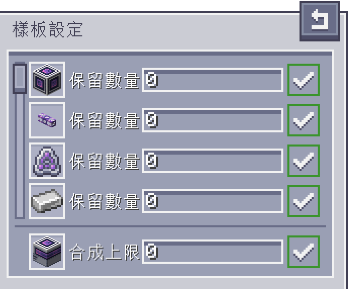

---
navigation:
  parent: aae_intro/aae_intro-index.md
  title: 量子合成器
  icon: advanced_ae:quantum_crafter
categories:
  - advanced devices
item_ids:
  - advanced_ae:quantum_crafter
---

# 量子合成器

<BlockImage id="advanced_ae:quantum_crafter" p:working="true" scale="4"></BlockImage>

量子合成器是一台強大，且可調整的自動化合成器。

由於它能隨時取用整個 AE 系統的物品，持續不斷地合成對它來說簡直輕而易舉。

這台機器能夠以極快的速度執行合成作業，同時確保你的系統不會耗盡重要資源。

此外，如同分子組裝機，量子合成器也能處理啟用「流體替代」的配方，

甚至還能處理遞迴合成 —— 即合成產物本身也是合成材料的情況。

---

## 使用合成器

若要使用量子合成器，你需要將其連結至 ME 網路，並確保有一個可用頻道供其運作。

接著，選擇你打算持續執行的配方，並將該配方編碼為合成樣板，然後放入合成器的對應欄位中。

放入樣板之後，你會看到每個樣板，都配有兩個對應的按鈕。

樣板下方的方形按鈕，用於啟用或停用該樣板。

被停用的樣板，將不會進行合成。而啟用的樣板，則會根據你設定的條件執行合成。

若要為樣板設定合成條件，你需要點擊樣板上方的齒輪按鈕，開啟樣板的設定介面。

樣板的設定介面中，會列出所有合成材料，以及其主要產物。

你可以在輸入框中填入數字，調整各項材料在 ME 系統中的保留數量，

還有最終產物的合成數量上限，避免過度合成昂貴的物品。

輸入所需的數字後（支援數學表達式），你需要按下 Enter 鍵來確認數值。

畫面右側的狀態圖示，用於表示所設數值是否已經套用。

若將合成上限的數值設為「0」，則會解除這項限制，持續合成直到可用的材料耗盡。

---

## 合成產物

預設情況下，量子合成器會嘗試將合成產物，直接送回 ME 網路。

點擊左側工具列上，帶有儲存單元圖示的按鈕，可將產物設定為輸出至相鄰容器。

啟用此設定後，會出現另一個按鈕，能讓你進一步設定產物的自動輸出方向。

這兩種設定的搭配，應該能讓你充分掌控，並發揮創意地使用合成器。

---

## 升級

若要完全發揮量子合成器的潛力，必須安裝升級卡。

這台機器支援 <ItemLink id="ae2:speed_card" /> 以及 <ItemLink id="ae2:redstone_card" />。

前者能大幅加快合成速度，達到每個樣板每刻可進行 64 次合成；後者則提供紅石控制選項。