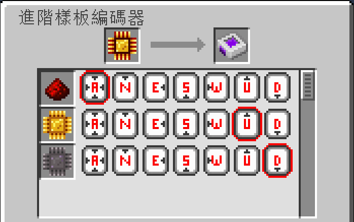

---
navigation:
  parent: aae_intro/aae_intro-index.md
  title: 進階樣板編碼器
  icon: advanced_ae:adv_pattern_encoder
categories:
  - advanced items
item_ids:
  - advanced_ae:adv_pattern_encoder
  - advanced_ae:adv_processing_pattern
---

# 進階樣板編碼器

為了告知 ME 進階樣板供應器，合成材料的輸出方向，

你需要使用一種特殊的編碼裝置，來記錄這些資訊。

手拿編碼器，點擊右鍵使用即可開啟其介面。

<ItemImage id="advanced_ae:adv_pattern_encoder" scale="4"></ItemImage>

---

將已編碼的處理樣板，放進左上角的欄位中進行解碼，

樣板的合成材料，將會以清單形式顯示在畫面左側。

清單的每一列都包含一組按鈕，分別對應方塊的各個面。

若維持預設的「X」按鈕，材料將會被發送到，與樣板供應器直接相鄰的任何一面。

若選擇指定某個面，材料將會強制從該方向，輸出至目標方塊。

要特別注意，進階樣板只能被<ItemLink id="advanced_ae:small_adv_pattern_provider" />正確解碼，  
若用於其他類型的樣板供應器，其材料的發送方式，將與普通樣板無異。

此外，若有任何單一物品，無法從指定的面送入目標方塊，  
則整份材料都將放棄以特定方向發送材料，改回使用標準的樣板供應器發送方式。