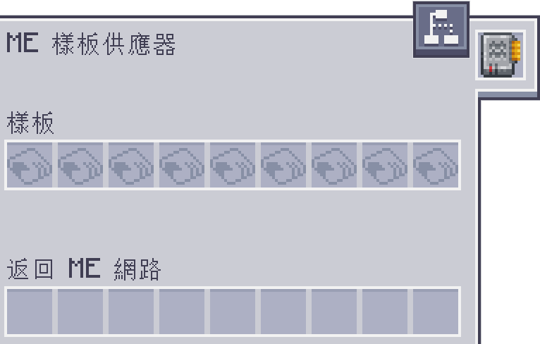

---
navigation:
  parent: aae_intro/aae_intro-index.md
  title: 反應室
  icon: advanced_ae:reaction_chamber
categories:
  - advanced devices
item_ids:
  - advanced_ae:reaction_chamber
---

# 反應室

<BlockImage id="advanced_ae:reaction_chamber" scale="4"></BlockImage>

反應室能藉由使用催化流體，以及龐大的能量，來加速化學反應。

如此一來，只會在世界上自然發生的反應，就可以被強制在反應室內發生。

而且大部分時候，由於環境變因能受到控制，因此反應產生的結果會更有效率。

---

# 為反應室供能

使用加速卡加快反應室運作時，會增加其總耗電速率，進而提高每刻所需的能量。

當直接透過 ME 系統供應能量時，反應室會嘗試從網路中，抽取每刻處理所需的能量。

若供給網路的發電量不足，ME 網路可能會因缺少能量而不斷重啟。

為了解決此問題，需要為 AE 系統配備充足的能量緩衝區，例如<ItemLink id="ae2:dense_energy_cell" />。

若 ME 驅動器中，有來自《Applied Flux》的 FE 儲存單元，  
反應室也能直接從該單元中取得能量，以便在不消耗網路能量的情况下進行合成。

若現階段沒有更多的發電量可用，減少機器安裝的加速卡數量也是一種選項。

為了適當地為反應室供應能量，有幾種方案可供選擇。

---

## 方塊形式的樣板供應器

<GameScene zoom="4" background="transparent">
  <ImportStructure src="../structure/full_block_provider_reaction_chamber.snbt"></ImportStructure>
</GameScene>

方塊形式的樣板供應器，能夠將相鄰的反應室直接連接至 ME 網路。

讓反應室能在需要的時候，從網路中抽取能量，並移除反應室其內部能量緩衝區的需求。

若網路中儲存的總能量，低於反應室每刻的耗電量，會導致其運作速度減慢，並在機器的畫面上顯示警告。

對於這種供電方式，建議在 ME 網路中，多連接幾個<ItemLink id="ae2:dense_energy_cell" />。

> 備註：面板形式的 ME 樣板供應器，或 ME 介面，會無法直接向其貼附的裝置供應網路能量。  
因此需要另外使用福魯伊克斯線纜，將反應室連接至網路。

---

## 感應卡（額外模組需求：應用通量 - Applied Flux）

<GameScene zoom="4" background="transparent" interactive={true}>
  <ImportStructure src="../structure/induction_card_provider_reaction_chamber.snbt"></ImportStructure>
  <BoxAnnotation color="#dddddd" min="0 1 0" max="1 2 1">
        設定指向的樣板供應器：

        在其介面中安裝感應卡。

        
  </BoxAnnotation>
  <BoxAnnotation color="#dddddd" min="2.1 1 0.1" max="2.9 1.3 0.9">
        面板形式的樣板供應器：

        在其介面中安裝感應卡。

        
  </BoxAnnotation>
</GameScene>

感應卡可被安裝在面板形式，或已設定指向的樣板供應器上，  
使它們能將 FE 儲存單元中的能量，輸出至其貼附的裝置。

只要使用方式正確，應該能順利填充反應室的能量緩衝區，並使其開始運作。

但要注意，感應卡以及其他一些 AE2 元件，都有一個加速度計時器，  
剛開始時運作速度較慢，但會隨著時間推移而加快速度。 

這代表由於起初缺乏能量，合成速度還不會達到最快，  
但隨著合成持續進行，感應卡最終應該能提供足夠的能量。

---

## 外部能量

為反應室供應能量的另一種方法，就是透過外部能量。

任何可主動供應能量的發電來源，應該都足以填充其緩衝區，並開始處理配方。

若供應的能量跟不上耗電速率，將會在機器的畫面上顯示警告。