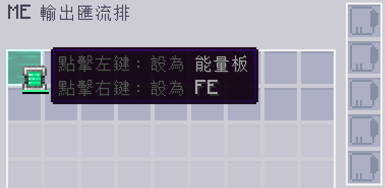

---
navigation:
  parent: appflux/appflux-index.md
  title: 在 ME 系統標記能量
categories:
- flux tricks
---

# 如何在篩選欄位上標記能量

你也許會想使用 <ItemLink id="ae2:export_bus"/> 來輸出能量，因此你需要在篩選欄位上標記 FE 能量。

使用能量容器對著欄位點擊右鍵，即可將 FE 能量標記在篩選欄位上。

