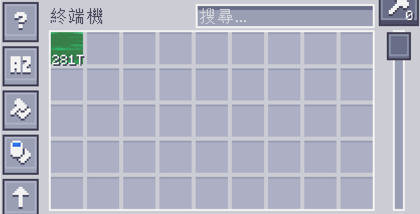
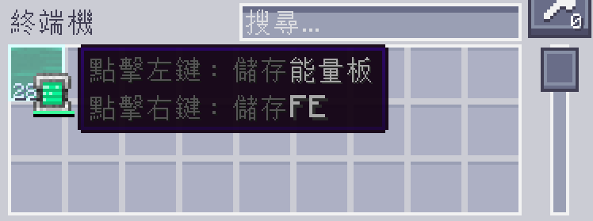

---
navigation:
  parent: appflux/appflux-index.md
  title: 終端機的互動方式
categories:
- flux tricks
---

# 終端機的互動方式

儲存在系統裡的能量，會以「*綠色流體*」的形式，顯示在終端機的介面中。

但這些並不是真正的流體，所以你無法使用鐵桶來將其裝填。

---

你可以使用能量容器，例如電池或電動工具，

來將能量存進這類容器當中，又或是將容器裡的能量釋放到系統中。

