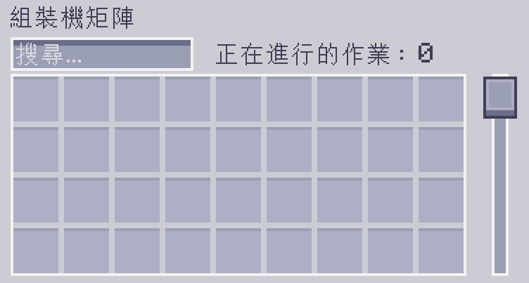

---
navigation:
    parent: epp_intro/epp_intro-index.md
    title: 組裝機矩陣
    icon: extendedae:assembler_matrix_frame
categories:
- extended devices
item_ids:
- extendedae:assembler_matrix_frame
- extendedae:assembler_matrix_wall
- extendedae:assembler_matrix_glass
- extendedae:assembler_matrix_pattern
- extendedae:assembler_matrix_crafter
- extendedae:assembler_matrix_speed
---

# 組裝機矩陣

<Row>
<BlockImage id="extendedae:assembler_matrix_frame" p:formed="true" p:powered="true" scale="5"></BlockImage>
<BlockImage id="extendedae:assembler_matrix_wall" scale="5"></BlockImage>
<BlockImage id="extendedae:assembler_matrix_glass" scale="5"></BlockImage>
</Row>
<Row>
<BlockImage id="extendedae:assembler_matrix_pattern" scale="5"></BlockImage>
<BlockImage id="extendedae:assembler_matrix_crafter" scale="5"></BlockImage>
<BlockImage id="extendedae:assembler_matrix_speed" scale="5"></BlockImage>
</Row>

組裝機矩陣是結合了 <ItemLink id="ae2:molecular_assembler" /> 與 <ItemLink id="ae2:pattern_provider" /> 功能的多方塊結構。

這台機器能夠同時進行大量的合成作業（前提是你的 ME 網路中，有足夠數量的 <ItemLink id="ae2:crafting_accelerator" />），並為你節省頻道開銷。

---

## 機器結構

<GameScene zoom="3" background="transparent" interactive={true}>
  <ImportStructure src="../structure/assembler_matrix.snbt"></ImportStructure>
</GameScene>

組裝機矩陣是一種長方體結構，其邊長介於 3 至 7 之間。
- 結構邊框由組裝機矩陣框架構成。
- 結構牆面由組裝機矩陣外牆／玻璃構成。
- 結構內部由組裝機矩陣樣板／合成／速度核心構成。

組裝機矩陣結構，內部須包含至少一個樣板核心與合成核心。

結構內部必須被核心元件填滿，不得保留空心。

當組裝機矩陣結構正確成形，並為其供應能量時，組裝機矩陣框架上的線條，將會變為藍色。

---

## 組裝機矩陣核心

總共有 3 種不同類型的組裝機矩陣核心。

- 組裝機矩陣樣板核心

組裝機矩陣只能使用其樣板核心供應的樣板。

每個樣板核心，能為組裝機矩陣提供 36 個樣板欄位。

- 組裝機矩陣合成核心

組裝機矩陣會將接收到的合成作業，指派給合成核心。

每個合成核心，能同時執行 8 個合成作業。

- 組裝機矩陣速度核心

這個核心的用途，相當於組裝機矩陣的 <ItemLink id="ae2:speed_card" />。

5 個速度核心，就能讓組裝機矩陣以最快的速度運作。

安裝多於 5 個數量的速度核心，將不會再給予額外的運作速度加成。

---

## 使用者介面

對著結構成形，且連上 ME 網路的組裝機矩陣點擊右鍵，能開啟它的使用者介面。

你可以在這介面中存入或搜尋樣板，並檢視正在進行的合成作業數量。
