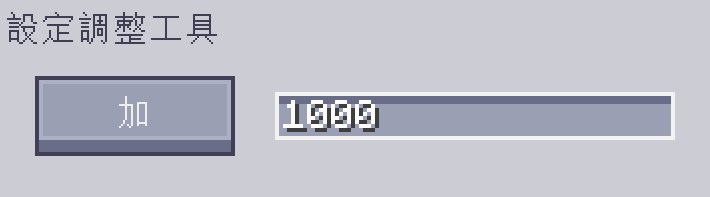

---
navigation:
    parent: epp_intro/epp_intro-index.md
    title: 設定調整工具
    icon: extendedae:config_modifier
categories:
- extended items
item_ids:
- extendedae:config_modifier
---

# 設定調整工具

設定調整工具是用於批量調整設備設定的工具。

<ItemImage id="extendedae:config_modifier" scale="4"></ItemImage>

點擊右鍵能夠開啟它的介面。

---

## 使用方式

設定調整工具可以根據其設定，快速調整 ME 介面等方塊的物品面板設定，

例如將面板上所有物品的數量設為最大值，又或是將所有物品移除。

你只需拿著設定調整工具，對著世界上的目標裝置（方塊或扁平部件）點擊右鍵，即可快速調整其設定。

---

## 設定

調整工具有兩個主要設定：**調整模式**與**調整數量（X）**。

你可以點擊按鈕來變更模式。

- 加/減/乘/除：將物品的設定數量增加/減少/乘以/除以 X 值。
- 設為最大：將物品的設定數量設為最大值。
- 設為最小：將物品的設定數量設為最小值。
- 設定：將物品的設定數量設為 X 值。
- 清除：清除物品面板上的所有設定。
