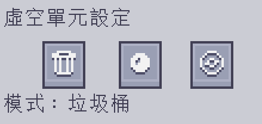

---
navigation:
    parent: epp_intro/epp_intro-index.md
    title: ME 虛空單元
    icon: extendedae:void_cell
categories:
- extended items
item_ids:
- extendedae:void_cell
---

# ME 虛空單元

安裝在驅動器中的口袋版物質聚合器。

<ItemImage id="extendedae:void_cell" scale="4"></ItemImage>

虛空單元在使用前必須在 <ItemLink id="ae2:cell_workbench" /> 上進行分區設定。

它會將相符其篩選器的物品全數銷毀，或像 <ItemLink id="ae2:condenser" /> 一樣，將它們聚合成<ItemLink id="ae2:matter_ball" />或<ItemLink id="ae2:singularity" />。

點擊右鍵能夠開啟它的介面。

