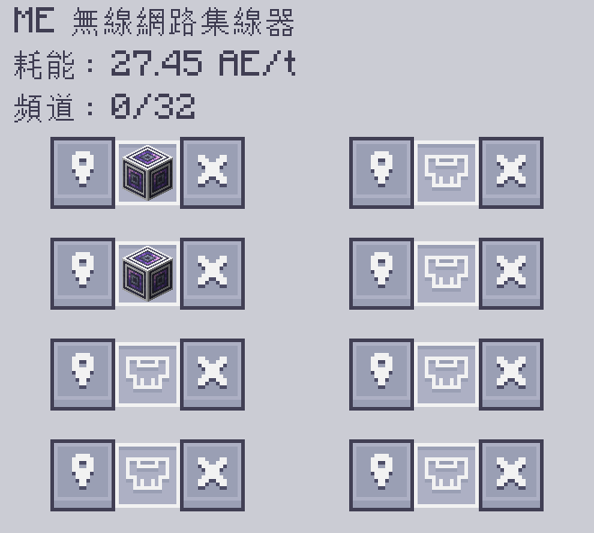

---
navigation:
    parent: epp_intro/epp_intro-index.md
    title: ME 無線網路集線器
    icon: extendedae:wireless_hub
categories:
- extended devices
item_ids:
- extendedae:wireless_hub
---

# ME 無線網路集線器

<Row gap="20">
<BlockImage id="extendedae:wireless_hub" scale="6"></BlockImage>
</Row>

ME 無線網路集線器的運作方式與 <ItemLink id="extendedae:wireless_connect" /> 完全相同， 

但它可以同時連接多達 8 個集線器或連接器。

---

## 連線設定

ME 無線網路集線器共有 8 個連接埠。

當你使用 <ItemLink id="extendedae:wireless_tool" /> 來建立連線時，它會自動尋找可用的連接埠。

然而，當所有連接埠都被佔用時，

你會需要先手動點擊介面中的「X」按鈕，來斷開現有的連線，

才能再與新的設備建立連線。
